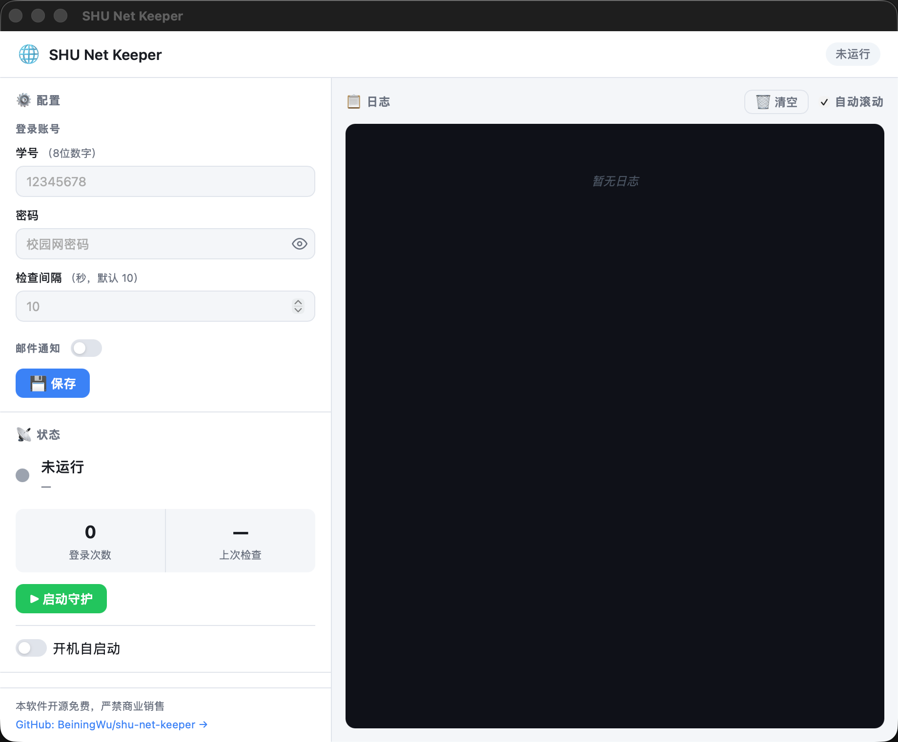

# SHU Net Keeper

<div style="text-align: center">

**上海大学校园网自动登录助手【已有稳定版release发布 欢迎使用】**

一个基于 Rust 开发的轻量级网络守护程序，自动检测并恢复校园网连接

[](https://www.rust-lang.org/)
[](https://www.microsoft.com/windows/)
[](https://www.apple.com/macos/)
[](https://www.linux.org/)
[](LICENSE)

</div>

## 项目动机

你是否也有过这样的经历：正在安静地写代码或看视频，校园网突然断开，不得不放下手中的事情去重新登录？对于使用 Linux 服务器或长期需要远程桌面服务的小伙伴来说更是如此。我们都有过这样的困扰——这就是这个项目的由来。一个简单却实用的工具，持续守护你的网络连接，断线自动重连，让你专注于真正重要的事。

## 功能特性

- 🖥️ **跨平台支持** - 支持 Windows、macOS、Linux 三大主流操作系统
- 🔄 **自动登录** - 定期检查网络状态，断网时自动重新登录
- 📧 **邮件通知** - 支持 SMTP 邮件通知，登录成功后发送提醒
- 🌐 **IP 监控** - 检测 IP 地址变化并及时通知
- ⚙️ **灵活配置** - 通过 TOML 配置文件自定义登录参数和检查间隔
- 📝 **详细日志** - 完整的日志记录系统，支持文件输出和按日期归档
- 🚀 **低资源占用** - Rust 编写，内存占用少，性能高效
- 🐳 **容器化部署** - 提供 Docker 支持，跨平台部署
- 🪟 **图形界面** - 提供 Tauri GUI 客户端，支持系统托盘和开机自启

## GUI 客户端

SHU Net Keeper 提供图形界面客户端（基于 Tauri），无需手动编辑配置文件，适合桌面用户日常使用。

### 界面预览

| 主界面 |
|--------|
|  |

### 下载安装

前往 [GitHub Releases](https://github.com/beiningwu/shu-net-keeper/releases) 下载对应平台的 GUI 安装包：

| 平台 | 文件名 |
|------|--------|
| macOS (Apple Silicon) | `SHU.Net.Keeper_aarch64.dmg` |
| macOS (Intel) | `SHU.Net.Keeper_x86_64.dmg` |
| Windows | `SHU.Net.Keeper_x86_64-setup.msi` |

> ⚠️ **macOS 权限注意**：首次运行可能提示无法验证开发者，请在「系统设置 → 隐私与安全性」中点击「仍要打开」，或执行：
> ```bash
> xattr -r -d com.apple.quarantine /Applications/SHU\ Net\ Keeper.app
> ```

### 功能说明

- **配置管理**：在左侧面板填写学号、密码和检查间隔，可选填 SMTP 邮件通知信息，点击「保存」即可。配置自动存储在系统应用数据目录，无需手动维护配置文件。
- **守护控制**：点击「▶ 启动守护」开始监控网络；点击「⏹ 停止守护」停止。当前连接状态（IP 地址、登录次数、IP 变更次数）实时显示在状态区域。
- **实时日志**：右侧日志面板实时滚动展示守护程序的运行记录，支持一键清空。
- **系统托盘**：关闭窗口后程序最小化到系统托盘，右键托盘图标可显示窗口或退出程序。
- **开机自启**：在状态面板底部勾选「开机自启动」，程序将随系统启动自动运行（macOS 使用 LaunchAgent，Windows 使用注册表）。

### 配置文件位置

GUI 版本将配置存储在平台应用数据目录（与 CLI 的 `config.toml` 相互独立）：

| 平台 | 路径 |
|------|------|
| macOS | `~/Library/Application Support/com.shu-net-keeper/` |
| Windows | `%APPDATA%\com.shu-net-keeper\` |
| Linux | `~/.local/share/com.shu-net-keeper/` |

---

## 快速开始（CLI）

### 下载程序

前往 [GitHub Releases](https://github.com/beiningwu/shu-net-keeper/releases) 下载对应系统的可执行文件，放在一个固定的目录（如 `C:\Tools\shu-net-keeper\` 或 `/usr/local/bin/`）。

### 配置文件

在可执行文件同目录下创建 `config.toml`：

```toml
# 必填：校园网账号信息
username = "your_student_id"
password = "your_password"

# 可选：检查间隔（秒），默认 10 秒
interval = 10

# 可选：是否启用 SMTP 邮件通知
smtp_enabled = false

# 可选：SMTP 邮件通知配置（当 smtp_enabled = true 时需要配置）
[smtp]
server = "smtp.example.com"       # SMTP 服务器地址
port = 465                        # SMTP 端口（推荐使用 465）
sender = "your_email@example.com" # 发件人邮箱
password = "your_email_password"  # 邮箱密码或授权码
receiver = "recipient@example.com" # 收件人邮箱
```

### 配置项说明

| 配置项 | 类型 | 必填 | 默认值 | 说明 |
|--------|------|------|--------|------|
| `username` | String | 是 | - | 校园网账号（学号） |
| `password` | String | 是 | - | 校园网密码 |
| `interval` | Integer | 否 | 10 | 网络状态检查间隔（秒） |
| `smtp_enabled` | Boolean | 否 | false | 是否启用邮件通知 |

### SMTP 配置项说明

| 配置项 | 类型 | 必填 | 说明 |
|--------|------|------|------|
| `server` | String | 是（启用邮件时） | SMTP 服务器地址 |
| `port` | Integer | 是（启用邮件时） | SMTP 端口（通常 465 或 587） |
| `sender` | String | 是（启用邮件时） | 发件人邮箱 |
| `password` | String | 是（启用邮件时） | 邮箱密码或授权码 |
| `receiver` | String | 是（启用邮件时） | 收件人邮箱 |

### 配置示例

**基础配置（仅自动登录）**：
```toml
username = "12345678"
password = "mypassword123"
interval = 10
```

**完整配置（包含邮件通知）**：
```toml
username = "20221234567"
password = "mypassword123"
interval = 10
smtp_enabled = true

[smtp]
server = "smtp.qq.com"
port = 465
sender = "123456789@qq.com"
password = "授权码"
receiver = "notify@example.com"
```

### 运行程序

配置完成后，运行程序：

```bash
# Windows
.\shu-net-keeper.exe

# Linux / macOS
./shu-net-keeper
```

> ⚠️ **macOS 权限注意**：首次运行可能提示"无法打开，因为无法验证开发者"。请在「系统设置 → 隐私与安全性」中点击「仍要打开」，或使用 `xattr -r -d com.apple.quarantine shu-net-keeper` 移除隔离属性。

程序会读取同目录下的 `config.toml` 配置文件，开始监控网络状态。

> 💡 如果需要后台运行且开机自启，请参考本文档「部署方式」章节。

## 部署方式

### Windows 系统

使用任务计划程序设置开机自启：

1. 打开"任务计划程序"
2. 创建基本任务 → 选择"当计算机启动时"触发
3. 操作选择"启动程序"，浏览到 `shu-net-keeper.exe`
4. 勾选"使用最高权限运行"

### macOS 系统

使用 macOS「登录项」实现开机自启：

1. **复制程序并添加执行权限**

   ```bash
   cp shu-net-keeper ~/Applications/
   cp config.toml ~/Applications/
   chmod +x ~/Applications/shu-net-keeper
   ```

2. **添加到登录项**

   - 打开「系统设置 → 通用 → 登录项」
   - 点击「+」添加 `~/Applications/shu-net-keeper`
   - 勾选「隐藏」让程序在后台运行

   或者使用命令添加：

   ```bash
   # 添加登录项（隐藏运行）
   osascript -e 'tell application "System Events" to make login item at end with properties {path:"/Users/你的用户名/Applications/shu-net-keeper", hidden:true}'

   # 查看登录项
   osascript -e 'tell application "System Events" to get the name of every login item'

   # 删除登录项
   osascript -e 'tell application "System Events" to delete login item "shu-net-keeper"'
   ```

### Linux 系统

使用 systemd 创建系统服务：

1. **创建 systemd 服务文件**

   ```bash
   sudo nano /etc/systemd/system/shu-net-keeper.service
   ```

2. **填入以下内容**

   ```ini
   [Unit]
   Description=SHU Network Auto Login Daemon
   After=network.target
   Wants=network-online.target

   [Service]
   Type=simple
   User=your_username # 替换为你的用户名
   WorkingDirectory=/home/your_username/shu-net-keeper # 替换为你的程序路径
   ExecStart=/home/your_username/shu-net-keeper/shu-net-keeper
   Restart=on-failure
   RestartSec=10

   # 日志配置
   StandardOutput=journal
   StandardError=journal

   [Install]
   WantedBy=multi-user.target
   ```

3. **部署和管理**

   ```bash
   # 创建目录并复制文件
   mkdir -p ~/shu-net-keeper
   cp shu-net-keeper ~/shu-net-keeper/
   cp config.toml ~/shu-net-keeper/
   chmod +x ~/shu-net-keeper/shu-net-keeper

   # 将 your_username 替换为你的用户名
   sudo cp shu-net-keeper.service /etc/systemd/system/

   # 重新加载 systemd 配置
   sudo systemctl daemon-reload

   # 启用开机自启
   sudo systemctl enable shu-net-keeper

   # 启动服务
   sudo systemctl start shu-net-keeper

   # 查看服务状态
   sudo systemctl status shu-net-keeper

   # 查看日志
   sudo journalctl -u shu-net-keeper -f

   # 停止服务
   sudo systemctl stop shu-net-keeper

   # 重启服务
   sudo systemctl restart shu-net-keeper
   ```

### Docker 部署

> **平台说明**：Docker 镜像同时支持 `linux/amd64`（x86_64 服务器）和 `linux/arm64`（ARM64 服务器 / Apple Silicon Mac）。构建前请根据实际部署环境选择目标平台。

#### 方式一：使用 Docker Compose（推荐）

1. **准备配置文件**

   ```bash
   # 创建日志目录
   mkdir -p logs

   # TODO: 将 your_config.toml 替换为你的配置文件名
   cp your_config.toml config.toml
   ```

2. **创建 docker-compose.yml**

   ```yaml
   version: '3.8'

   services:
     shu-net-keeper:
       build: .
       # 根据部署环境选择目标平台：
       #   linux/amd64  —— x86_64 服务器
       #   linux/arm64  —— ARM64 服务器 / Apple Silicon Mac
       platform: linux/amd64
       # TODO: 可自定义容器名称
       container_name: shu-net-keeper
       restart: unless-stopped
       network_mode: host  # 使用宿主机网络，确保能访问校园网
       volumes:
         # TODO: 确保 config.toml 存在于项目根目录
         - ./config.toml:/app/config.toml:ro
         - ./logs:/app/logs
       environment:
         - TZ=Asia/Shanghai
         - RUST_LOG=info  # 可选：debug, info, warn, error
   ```

3. **启动服务**

   ```bash
   docker-compose up -d

   # 查看日志
   docker-compose logs -f

   # 停止服务
   docker-compose down
   ```

#### 方式二：使用 Docker 命令

```bash
# 构建镜像（--platform 根据部署环境选择 linux/amd64 或 linux/arm64）
docker build --platform linux/amd64 -t shu-net-keeper .

# 创建日志目录
mkdir -p logs

# TODO: 将 your_config.toml 替换为你的配置文件名
# 运行容器
docker run -d \
  --name shu-net-keeper \
  --platform linux/amd64 \
  --network host \
  --restart unless-stopped \
  -v $(pwd)/config.toml:/app/config.toml:ro \
  -v $(pwd)/logs:/app/logs \
  -e TZ=Asia/Shanghai \
  -e RUST_LOG=info \
  shu-net-keeper

# 查看日志
docker logs -f shu-net-keeper

# 停止容器
docker stop shu-net-keeper

# 重启容器
docker restart shu-net-keeper
```

## 故障排查

### 问题一：程序无法启动

- 检查 `config.toml` 是否存在且格式正确
- 查看日志文件中的错误信息
- 确认账号密码是否正确

### 问题二：自动登录失败

- ***检查学号、密码是否正确填写***
- 确认是否在校园网环境内且网络连接是否正常
- 查看日志中的具体错误信息
- 手动访问 `http://10.10.9.9` 测试登录页面是否可访问

### 问题三：邮件通知发送失败

- 确认邮箱已开启 SMTP 服务
- 确认 SMTP 服务器地址和端口正确
- 检查邮箱授权码或密码（注意确认是***授权码***，还是***登录密码***）

### 问题四：Docker 容器无法连接网络

- 确保使用 `--network host` 模式
- 检查宿主机是否在校园网环境
- 查看容器日志：`docker logs shu-net-keeper`

> 💡 如遇到其他问题无法解决，欢迎提交 [Issue](https://github.com/beiningwu/shu-net-keeper/issues) 反馈。

## 常见邮箱 SMTP 配置

> ⚠️ 推荐使用 QQ 邮箱或 163 邮箱。

| 邮箱服务商 | SMTP 服务器 | 端口 | 备注 |
|-----------|------------|------|------|
| QQ 邮箱 | smtp.qq.com | 465 / 587 | 需要使用授权码 |
| 163 邮箱 | smtp.163.com | 465 / 587 | 需要使用授权码 |
| Gmail | smtp.gmail.com | 465 / 587 | 需要开启两步验证并使用应用专用密码 |
| Outlook | smtp.office365.com | 465 / 587 | 直接使用邮箱密码 |

## 许可证

本项目采用 MIT 许可证 - 详见 [LICENSE](LICENSE) 文件

## 免责声明

本工具仅供学习交流使用，请遵守学校网络使用规定。使用本工具产生的任何问题由使用者自行承担。

## 贡献

欢迎所有形式的贡献！无论是报告 Bug、提出功能建议，还是直接提交代码，都非常感谢。

### 报告问题 / 提出建议

请前往 [GitHub Issues](https://github.com/beiningwu/shu-net-keeper/issues) 提交，并尽量包含以下信息：

- 操作系统和版本
- 使用的是 CLI 版本还是 GUI 版本
- 问题的复现步骤
- 相关日志输出（CLI：`logs/` 目录；GUI：日志面板内容）

### 提交代码

1. **Fork** 本仓库并 clone 到本地
2. 基于 `main` 创建功能分支：`git checkout -b feat/your-feature`
3. 编写代码，确保通过以下检查：
   ```bash
   cargo clippy -- -D warnings   # 无 clippy 警告
   cargo fmt --all -- --check    # 格式符合规范
   cargo test                    # 所有测试通过
   ```
4. 提交 commit，建议使用语义化提交信息（如 `feat:`, `fix:`, `refactor:`）
5. 推送分支并发起 **Pull Request**，说明改动内容和动机

### 从源码构建

**前置要求**：Rust 1.70+，Cargo

```bash
# 克隆仓库
git clone https://github.com/beiningwu/shu-net-keeper.git
cd shu-net-keeper

# 构建 CLI Release 版本
cargo build --release
# 可执行文件：Linux/macOS → target/release/shu-net-keeper
#              Windows   → target\release\shu-net-keeper.exe

# 构建 GUI（需要先安装 Tauri CLI）
cargo install tauri-cli --version "^2"
cargo tauri build
# 安装包输出至 src-tauri/target/release/bundle/
```

### 开发模式

```bash
# CLI 开发 & 测试
cargo build
cargo test

# GUI 开发预览
cargo tauri dev
```

详细架构说明请参阅 [CLAUDE.md](CLAUDE.md)（面向开发者的项目指引）。
